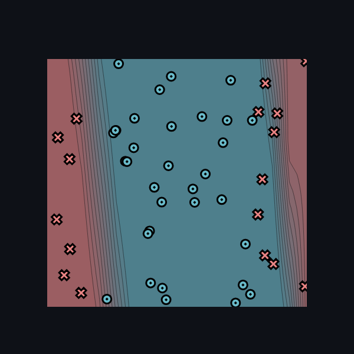

[](https://classroom.github.com/a/YFgwt0yY)
# MiniTorch Module 2


* Docs: https://minitorch.github.io/

* Overview: https://minitorch.github.io/module2/module2/

This assignment requires the following files from the previous assignments. You can get these by running

```bash
python sync_previous_module.py previous-module-dir current-module-dir
```

The files that will be synced are:

        minitorch/operators.py minitorch/module.py minitorch/autodiff.py minitorch/scalar.py minitorch/scalar_functions.py minitorch/module.py project/run_manual.py project/run_scalar.py project/datasets.py

# Simple dataset

## Parameters

- Points: 50
- Hidden layer size: 2
- Learning rate: 0.5
- Epochs: 250


Time per epoch: 0.049s.


# Diagonal dataset

## Parameters

- Points: 50
- Hidden layer size: 2
- Learning rate: 0.5
- Epochs: 250


Time per epoch: 0.049s.

# Split

## Parameters

- Points: 50
- Hidden layer size: 4
- Learning rate: 0.5
- Epochs: 350




Time per epoch: 0.101s.


# XOR

## Parameters

- Points: 50
- Hidden layer size: 5
- Learning rate: 0.5
- Epochs: 200


Time per epoch: 0.132s.

